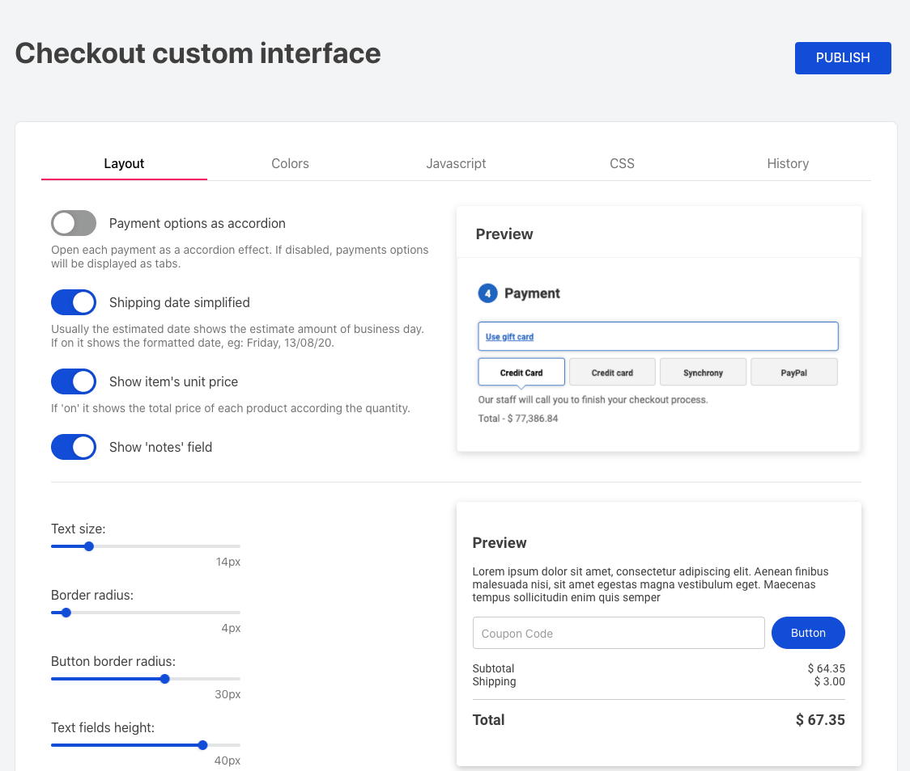

# Checkout UI Custom

The **Checkout UI Custom** app is responsible for **customizing your store's Checkout UI through interface**.

## Configuration

1.  Using your terminal and the [VTEX IO Toolbelt](https://vtex.io/docs/recipes/development/vtex-io-cli-installment-and-command-reference), log into the desired account;
2.  Run `vtex install vtex.checkout-ui-custom` on the account you're working on. If the Checkout Custom option already exists, you can skip to step 7 of this step-by-step;
3.  Head over to YOUR_ACCOUNT.myvtex.com/admin/vtex-checkout-ui-custom/, this link is also available from the navigation menu under "Store Setup > Checkout UI Custom"
4.  Make the desired changes and click 'Publish', or simply click 'Publish' to send the default configuration to your workspace, otherwise you'll not see any changes on your checkout

You can access the changes history, load its configuration and make changes on top of it. 
Lets assume you were working on a workspace called `testredcolor` and want to send it to production, switch to master, "Store Setup > Checkout UI Custom" click on the **History** tab, load your last change from the `testredcolor` workspace, and click **PUBLISH**

:warning: It's important to test your changes on a different workspace before applying to master

## Modus Operandi 

Once the app is installed in the account, the files `checkout6-custom.js` and `checkout6-custom.css` will be replaced by the files generated by this app.
